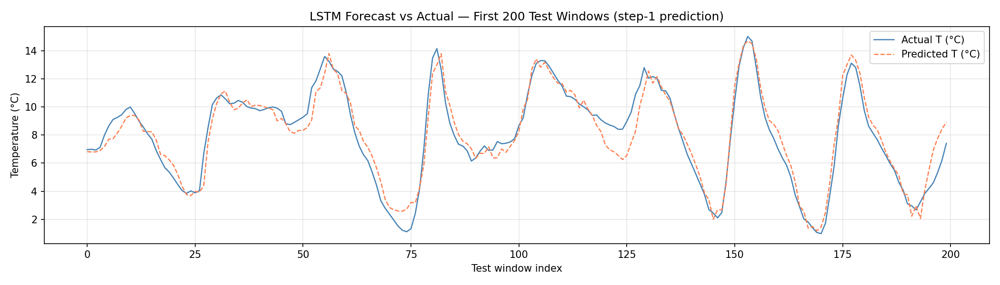

# PyTorch LSTM Temperature Forecaster

Multi-step time-series forecasting on the Jena Climate dataset using a stacked LSTM.
Served via FastAPI, tracked with MLflow, and deployed as a self-contained Gradio Space.

**[Live Demo →](https://huggingface.co/spaces/Priyrajsinh/PyTorch-LSTM-Forecaster)**


---

## Architecture

```
Jena Climate CSV
    → hourly resample (1 h)
    → wind direction sin/cos encoding
    → chronological split  (70 / 15 / 15)
    → StandardScaler (fit on train only)
    → SlidingWindowDataset (lookback=72 h)
    → LSTMForecaster (2 layers, hidden=64)
    → FastAPI /forecast  +  Self-Contained Gradio Space
```

---

## Multi-Horizon Evaluation Results

| Horizon | MSE (°C²) | MAE (°C) | RMSE (°C) |
|---------|-----------|----------|-----------|
| 6 h     | 2.65      | 1.22     | 1.63      |
| 12 h    | 4.25      | 1.55     | 2.06      |
| 24 h    | 5.99      | 1.87     | 2.45      |
| 48 h    | 9.10      | 2.31     | 3.02      |

---

## Forecast vs Actual



---

## Project Structure

```
src/
  data/        — loading, validation (Pandera), preprocessing, EDA
  models/      — LSTMForecaster (MIMO, stacked LSTM + linear head)
  training/    — train loop, early stopping, MLflow tracking
  evaluation/  — multi-horizon MSE/MAE/RMSE, forecast plot
  api/         — FastAPI app (rate-limited, Prometheus metrics)
hf_space/      — self-contained Gradio Space (no FastAPI dependency)
tests/         — 50 tests, 86% coverage
```

---

## Quickstart

```bash
pip install -r requirements.txt

# Train
python -m src.training.train --config config/config.yaml

# Evaluate
python -m src.evaluation.evaluate --config config/config.yaml

# Serve
uvicorn src.api.app:app --host 0.0.0.0 --port 8000

# Docker
docker build -t b3-lstm-forecaster .
docker run -p 8000:8000 b3-lstm-forecaster
```

---

## API Endpoints

| Method | Path                | Description                        |
|--------|---------------------|------------------------------------|
| GET    | `/api/v1/health`    | Liveness + model status + uptime   |
| POST   | `/api/v1/forecast`  | Multi-step temperature forecast    |
| GET    | `/api/v1/model_info`| Architecture metadata + results    |
| GET    | `/metrics`          | Prometheus metrics                 |

---

## References

- Hochreiter, S. & Schmidhuber, J. (1997). *Long short-term memory.* Neural Computation, 9(8).
- Chollet, F. (2017). *Deep Learning with Python* — Jena Climate dataset.
